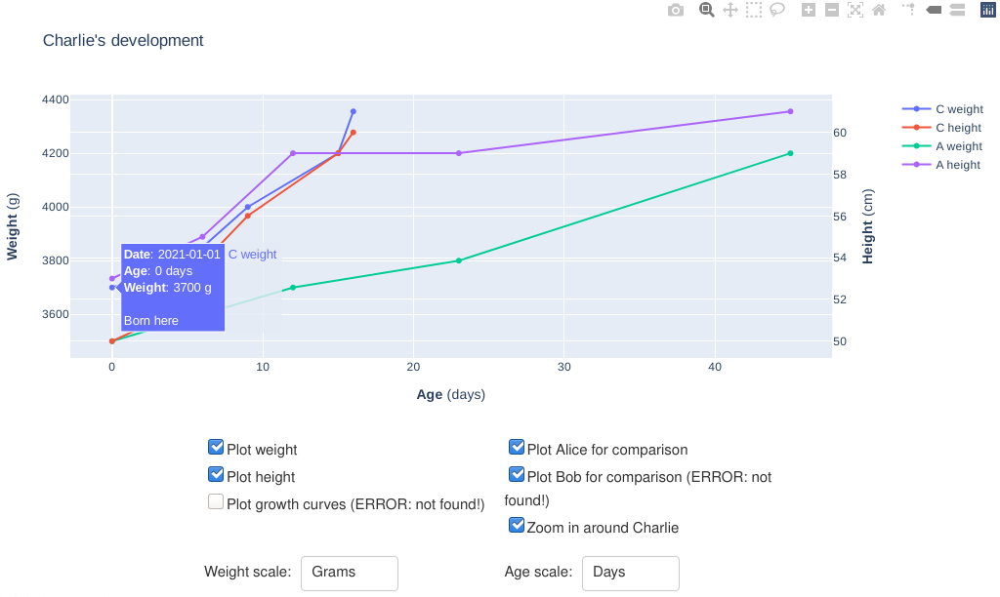
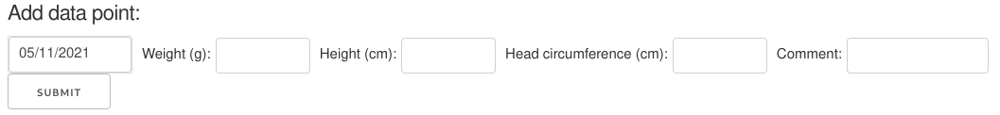

# gottenso 👶📈

[](https://travis-ci.com/hwikmark/gottenso)

### Introduction

__gottenso__ is a dashboard for keeping and displaying records of a child's height and weight as a function of age.

The GUI has two modes, accessible via different logins: The `parent` login can display and enter data, whereas the `family` login can only display the data.

The data is read and stored as .CSV files, which are human-readable and easily made from other software such as spreadsheets and some "baby tracker" apps.

Sharing the data / plots with others requires a web server such as [gunicorn](https://gunicorn.org/), which can quite easily be installed and run on your own server or a VPS. Note that you probably want to set up HTTPS and possibly other security measures in order not to distribute personal information everywhere (there are tutorials online for these things).

___Very___ __important note and disclaimer:__ The code in this repo provides no means of backup. Back up your data if you want to keep it!

### GUI and instructions



The first image shows the common interface for both the `parent` and `family` users. The plot will show the height and weight over time for your child along with data for the parents and standard growth curves (if available). Hovering over a point will give some more detailed data along with a comment if there is one. You can choose whether to plot standard growth curves as well as data for one or both parents. If an option is followed by (ERROR: not found!) this means the filename may not be properly set (see the section on environmental variables).



As shown in the second image, the `parent` login has access to a data entry form, where one can add weight, height and head circumference, along with a comment (e.g. how the measurements were done). Note that one does not need to fill every box for the measurement to be saved.

### Getting started
The easiest way to get started is to clone this repo. After installing the requirements in `requirements.txt`, you can (but don't have to) run `setup.py` which will make a settings file and some dummy data (shown in the screen shots). When you have data and settings, you can run the main app `app.py`.

```console
$ pip3 install -r requirements.txt
$ python3 setup.py
$ python3 app.py
```

When this is done, navigate to <http://127.0.0.1:8050/>!

### Where do I get growth curves?
As I'm not sure about the legal implications of including the curves in the repo, I would suggest you get them from e.g. [the WHO](https://www.who.int/tools/child-growth-standards/standards) or use national statistics:
- Sweden: The data is available in Albertsson Wikland et al, _Acta Pediatrica_, [DOI:10.1080/08035250213216](doi.org/10.1080/08035250213216).
- USA: You can get data from [the CDC](https://www.cdc.gov/growthcharts).

### Environment variables
The app will read settings from environment variables, or from a .env file if the variables don't exist.

#### Basic app setup
- **APPLANG:** Language to use for the app (see available languages in `locales/`).
- **APPNAME:** App name (used e.g. in browser window title).
- **FAMILY:** Password for `family` user.
- **PARENT:** Password for `parent` user.
#### Data file locations
- **CFILE:** Location of child's data file.
- **GROFILE:** Location of growth curves (see section on this).
- **P1FILE:** Location of Parent 1's data file.
- **P2FILE:** Location of Parent 2's data file.
- **LOGFILE:** Location of app's access log.
#### .csv column names
- **AGECOL:** Age in days.
- **COMCOL:** Comment.
- **DATECOL:** Date in ISO-format string.
- **HEADCOL:** Head circumference in cm.
- **HEIGHTCOL:** Height in cm.
- **WEIGHTCOL:** Weight in grams.
- **SDHTCOL:** SD for height in cm.
- **SDWTCOL:** SD for weight in grams.
#### Misc data
- **CHILDBDAY:** Child's birthday (used to display dates).
- **CHILDNAME:** Child's name.
- **MAX_AGE:** When the _"Zoom in"_ option is selected, how much "more" (in age) parent data to display.
- **P1BDAY:** Parent 1's birthday.
- **P1NAME:** Parent 1's name.
- **P2BDAY:** Parent 2's birthday.
- **P2NAME:** Parent 2's name.

### Todo / outlook
Some ideas for improvement and added features:
- More translations and localizations (e.g. locale-specific date formats)
- Plot multiple kids
- Other measurement systems such as imperial
- File downloads(?)

Improvements to the codebase / app:
- Improved testing and CI
- Code cleanup
- App layout

### Credits and acknowledgements
Made in 2020-2021 by Hampus Wikmark Kreuger.

gottenso uses [Dash](http://dash.plotly.com/),
[Numpy](https://numpy.org/),
[Pandas](https://pandas.pydata.org/), [Python-decouple](https://github.com/henriquebastos/python-decouple/), and
[Python-dotenv](https://github.com/theskumar/python-dotenv) along with core Python libraries. CSS layout by [chriddyp](https://codepen.io/chriddyp) /
[Dave Gamache](https://github.com/dhg).
